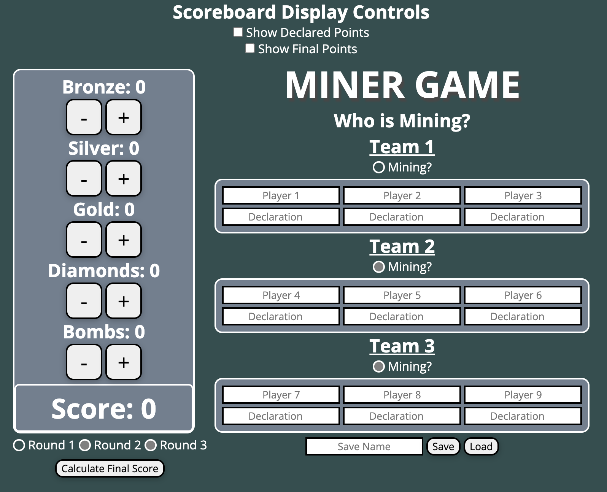
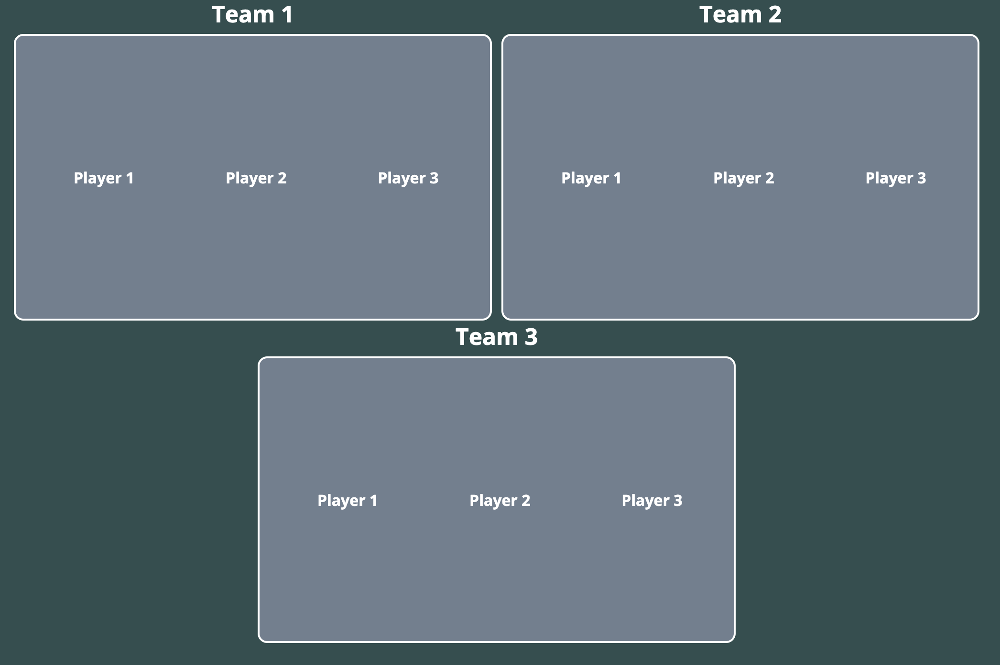

# King's Crown Mining Game
This is an application using the electron framework running on Node.js.
It is an app I created for a scorekeeper to use during a game show.

It is meant to be used across two monitors.
One window contains the scorekeeper's controls and the other displays the players, teams, and their respective scores.

The game which is being played is the Mining Game from **The Genius** game show **Season 3 Episode 5**.
Rules can be found at the bottom of this Readme.

A friend of mine held his own version of this game at an event he titled 'King's Crown' which this software was created for.

---
## Scorekeeper Controls

Pictured above is a screenshot of the scorekeeper's view.
The scorekeeper can toggle between each round of the game and change the team which is mining.

Player names will update live on the **Scoreboard** window when they are input into the form.

Point declarations for each round will be saved to memory when they are input into the form.

The **Score** will be calculated based on the number of each mineral found by players.

The checkboxes **Show Declared Points** and **Show Final Points** will toggle the visibility of scores on the **Scoreboard** window.

The **Calculate Final Score** button will display the score calculations of the current mining session.

Game data can be saved and loaded using the respective **Save** and **Load** buttons, and the game will automatically save when switching between rounds.
The save name is '[Save Name]-round-[Round Number]'.
By default, the save names for each round are 'round-round-1', 'round-round-2', and 'round-round-3'.

Game data includes the player names, their declared points during each mining session, and the mining score for each session.

## Scoreboard Display

Pictured above is a screenshot of the scoreboard.
This is meant to be displayed to players during the game.

The player names will update when they are input by the scorekeeper.

The scorekeeper can toggle to show the number of points mined during a round and the number of points declared by non-miners.

The scorekeeper can toggle to show the final number of points at the end of all three rounds.

___
## Important Bug to Note
The **Scoreboard** may show 'NaN' for all values if the **Show Final Points** toggle is on.
This is because the application calculates final points using the final score from all nine rounds of play.

Ensure that the **Calculate Final Score** button has been pressed after every mining session to generate the scores to be used in this calculation.

Ensure that the **Save** button is pressed at the end of each of the three rounds.
All three rounds must be saved before using the **Show Final Points** toggle to show final point calculations.

___
## Game Rules
### Objective
Form teams of three to mine minerals and accumulate points. Avoid hazards, maximize points, and manage risks to win.

### Setup
Nine players will participate. Draw lots to form three teams of three players each.

### Gameplay
The Miner Game is played over three rounds.
Teams take turns mining for minerals.
While a team mines, the other six players decide privately how many points they wish to take from that team's mined amount (min. 1 point, max. 50 points).

Once the mining team finishes, the number of points each non-mining player chooses is revealed.
Minerals are then returned into the mine.
The next team rotates in as miners.

In rounds 2 and 3, teams mine in order of lowest to highest points.

### Mining
Each player mines in turn, with no player mining twice consecutively.
Players can mine as many times and minerals as they want during their turn.
If players wish to stop mining, then they announce it, ending that team's turn.

**Bronze** is one point. **Silver** is two points. **Gold** is three points.
**Diamonds** will double the score. Having three or more **Bombs** will reset the score to 0.

### Round Completion
When all teams have mined, the round ends.
The total points from the mine are then calculated
The points chosen by non-mining players are then revealed

#### Distribute points as follows:
**If points mined are higher or equal to total points declared**:

Non-miners receive their declared points and miners split the remainder.

**If mined points are less than declared**:

Non-miners receive nothing and miners split the total points mined.

**If three bombs were mined**:

No points are awarded to miners. Non-miners receive their declared points.

**If miners fail to meet the declared points**:

The player who chose the highest loses their points which are given to the player who declared the lowest.

In this scenario, if there are multiple players who declared the lowest amount of points during a round, then the declared points from the highest player is split amongst them.
If there are multiple players with the highest amount of points declared during a round, then the sum of their declarations goes to the player with the lowest declared points.
